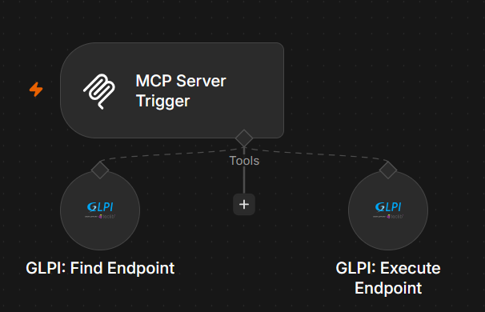

# n8n-nodes-glpi

*[Read this in English](README.md)*

Ce package connecte vos workflows [n8n](https://n8n.io) à **GLPI**, l'outil open source de gestion de parc informatique et de support (tickets, ordinateurs, utilisateurs, projets, entités, etc.), via l'API REST de GLPI.

Il propose deux façons d'utiliser cette API :
- Le node **GLPI API**, pour des workflows construits à la main : créer un ticket, récupérer un utilisateur, mettre à jour un ordinateur... N'importe quelle action disponible dans l'API de GLPI est accessible via deux listes déroulantes — une **catégorie**, puis l'**action** précise — affichées exactement comme dans la documentation officielle de GLPI. Les champs à remplir (identifiant d'un ticket, informations à envoyer, etc.) changent automatiquement selon l'action choisie, sans avoir besoin d'écrire du JSON à la main (sauf si vous préférez).
- **GLPI: Find Endpoint** et **GLPI: Execute Endpoint**, pour un Agent IA ou un client MCP : l'agent décrit ce qu'il veut en langage naturel, récupère l'endpoint correspondant avec ses champs exacts, puis l'appelle — sans connaître l'API de GLPI au préalable. Voir [Outils Agent IA / MCP](#outils-agent-ia--mcp) plus bas.

  

## Sommaire

- [Prérequis](#prérequis)
- [Installation](#installation)
- [Authentification](#authentification)
- [Node GLPI API — Utilisation](#node-glpi-api--utilisation)
- [Node GLPI API — Exemples](#node-glpi-api--exemples)
- [Outils Agent IA / MCP](#outils-agent-ia--mcp)
- [Contribuer](#contribuer)

## Prérequis

- Une instance **GLPI** exposant la High-Level REST API (`/api.php/v2.3`, distincte de l'ancienne `/apirest.php`).
- Un client OAuth2 déclaré côté GLPI (Configuration générale > API > Clients OAuth2).

## Installation

Depuis n8n : **Settings > Community Nodes > Install**, renseigner `@bessantoy/n8n-nodes-glpi`.

## Authentification

Deux types de credential, au choix via le champ **Authentication** du node :

- **OAuth2 (Authorization Code)** — credential `GLPI OAuth2 API`. Renseigner **GLPI Base URL**, **Client ID**/**Client Secret**, puis se connecter via "Connect my account" (mécanisme standard n8n).
- **Password Grant** — credential `GLPI Password Grant API`, pour un usage serveur-à-serveur sans interaction. Renseigner **Base URL**, **Client ID/Secret**, **Username/Password**, **Scope**. Le token est mis en cache et renouvelé automatiquement.

**Context Options** (sur chaque requête) : GLPI Entity, GLPI Profile, GLPI Entity Recursive, Accept Language → headers `GLPI-Entity`, `GLPI-Profile`, `GLPI-Entity-Recursive`, `Accept-Language`.

## Node GLPI API — Utilisation

1. **Category** — la vraie catégorie GLPI (tag OpenAPI de l'endpoint), triée alphabétiquement comme la doc officielle.
2. **Route** — méthode + chemin affichés ensemble (ex. `GET /Assistance/Ticket/{id}`), exactement comme dans la doc.
3. Un champ apparaît automatiquement pour chaque `{placeholder}` de la route (ex. **Asset Itemtype**, **Asset ID**), avec un nom lisible — chaque champ accepte aussi une expression n8n (`{{$json.ticket_id}}`).
4. **Query Options** *(GET)* : Filter (RSQL), Sort, Start/Limit. **Return All** paginer automatiquement.
5. **Body** *(POST/PATCH)* — champ **Specify Body** : soit l'éditeur JSON libre, soit une liste **Name/Value** (comme le node HTTP Request natif) où les valeurs numériques/booléennes/JSON sont envoyées avec leur vrai type.

  

## Node GLPI API — Exemples

**Récupérer un ticket**
- Category: `Assistance` → Route: `GET /Assistance/Ticket/{id}` → champ **ID**: `1234`

**Créer un ticket sans écrire de JSON**
- Category: `Assistance` → Route: `POST /Assistance/Ticket`
- Specify Body: `Using Fields Below` → `name` = `Imprimante HS`, `urgency` = `3` (envoyé comme nombre)

**Endpoint à plusieurs paramètres (installer un OS sur un asset)**
- Category: `Assets` → Route: `POST /Assets/{asset_itemtype}/{asset_id}/OSInstallation`
- Champ **Asset Itemtype**: `Computer` · Champ **Asset ID**: `1234`
- Body : `{ "operatingsystems_id": 1 }`

## Outils Agent IA / MCP

Deux nodes supplémentaires, pensés pour être branchés sur un Agent IA ou un MCP Server Trigger plutôt que câblés à la main :

  

- **GLPI: Find Endpoint** — prend une requête en langage naturel (`query`, ex. "créer un ticket") et renvoie l'endpoint (ou les endpoints) correspondant, avec leurs champs exacts, à partir des index bundlés (aucun appel à GLPI).
- **GLPI: Execute Endpoint** — prend une `method` + `path` exactes (celles renvoyées par Find Endpoint) plus `queryParams`/`body` optionnels, et appelle GLPI. Partage le même credential **Authentication** que le node GLPI API.

Usage typique : l'agent appelle Find Endpoint pour trouver la bonne route et ses champs, puis appelle Execute Endpoint avec les valeurs choisies.

## Contribuer

Ce package est open source. Pour le développement local, la mise à jour de la liste des endpoints lors d'une nouvelle version de l'API GLPI, ou la publication npm, voir [CONTRIBUTING.md](CONTRIBUTING.md).

## Licence

MIT
