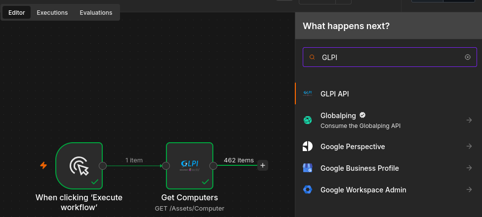
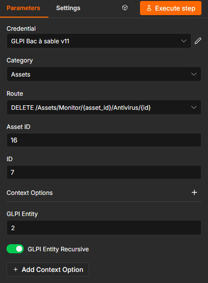

# n8n-nodes-glpi

*[Lire en français](README.fr.md)*

This package adds a **GLPI API** node to [n8n](https://n8n.io) to connect your workflows to **GLPI**, the open source IT service and asset management tool (tickets, computers, users, projects, entities, etc.).

A single node covers everything you need: create a ticket, fetch a user, update a computer... Any action available in the GLPI API is reachable through two dropdowns — a **category**, then the precise **action** — displayed exactly as in GLPI's official API documentation. The fields to fill in (a ticket ID, the data to send, etc.) change automatically depending on the action you pick, with no need to hand-write JSON (unless you'd rather).

  

## Table of Contents

- [Prerequisites](#prerequisites)
- [Installation](#installation)
- [Authentication](#authentication)
- [Usage](#usage)
- [Examples](#examples)
- [Contributing](#contributing)

## Prerequisites

- A **GLPI** instance exposing the High-Level REST API (`/api.php/v2.3`, distinct from the older `/apirest.php`).
- An OAuth2 client registered on the GLPI side (General setup > API > OAuth2 clients).

## Installation

From n8n: **Settings > Community Nodes > Install**, enter `@bessantoy/n8n-nodes-glpi`.

## Authentication

Two credential types, selectable via the node's **Authentication** field:

- **OAuth2 (Authorization Code)** — `GLPI OAuth2 API` credential. Fill in **GLPI Base URL**, **Client ID**/**Client Secret**, then connect via "Connect my account" (standard n8n mechanism).
- **Password Grant** — `GLPI Password Grant API` credential, for unattended server-to-server use. Fill in **Base URL**, **Client ID/Secret**, **Username/Password**, **Scope**. The token is cached and refreshed automatically.

**Context Options** (on every request): GLPI Entity, GLPI Profile, GLPI Entity Recursive, Accept Language → headers `GLPI-Entity`, `GLPI-Profile`, `GLPI-Entity-Recursive`, `Accept-Language`.

## Usage

1. **Category** — the actual GLPI category (the endpoint's OpenAPI tag), sorted alphabetically like the official docs.
2. **Route** — method + path shown together (e.g. `GET /Assistance/Ticket/{id}`), exactly as in the docs.
3. A field appears automatically for every `{placeholder}` in the route (e.g. **Asset Itemtype**, **Asset ID**), with a readable name — every field also accepts an n8n expression (`{{$json.ticket_id}}`).
4. **Query Options** *(GET)*: Filter (RSQL), Sort, Start/Limit. **Return All** to paginate automatically.
5. **Body** *(POST/PATCH)* — **Specify Body** field: either the free-form JSON editor, or a **Name/Value** list (like the native HTTP Request node) where numeric/boolean/JSON values are sent with their real type.

  

## Examples

**Fetch a ticket**
- Category: `Assistance` → Route: `GET /Assistance/Ticket/{id}` → field **ID**: `1234`

**Create a ticket without writing JSON**
- Category: `Assistance` → Route: `POST /Assistance/Ticket`
- Specify Body: `Using Fields Below` → `name` = `Printer down`, `urgency` = `3` (sent as a number)

**Endpoint with several parameters (install an OS on an asset)**
- Category: `Assets` → Route: `POST /Assets/{asset_itemtype}/{asset_id}/OSInstallation`
- Field **Asset Itemtype**: `Computer` · Field **Asset ID**: `1234`
- Body: `{ "operatingsystems_id": 1 }`

## Contributing

This package is open source. For local development, updating the endpoint list on a new GLPI API version, or npm publishing, see [CONTRIBUTING.md](CONTRIBUTING.md).

## License

MIT
